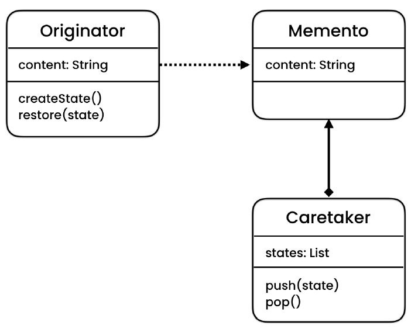

# Behavioral Design Patterns

### Memento: 
> Allows restoring an object to a previous state.

### State: 
> Allows an object to behave differently depending on the state it is in.

### Iterator: 
> Allows iterating over an object without having to expose the object’s internal structure (which may change in the future).

### Strategy: 
> Allows passing different algorithms (behaviours) to an object. Allows defining a template (skeleton) for an operation. Specific 
> steps will then be implemented in subclasses.

### Command: 
> Allows decouple a sender from a receiver. The sender will talk to the receive through a command. Commands can be undone and 
> persisted.

### Observer: 
> Allows an object notify other objects when its state changes.

### Mediator: 
> Allows an object to encapsulate the communication between other objects.

### Chain of Responsibility: 
> Allows building a chain of objects to process a request.

### Visitor: 
> Allows adding new operations to an object structure without modifying it.

